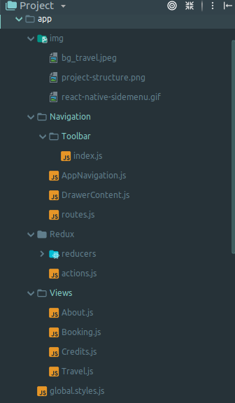

# React Native Side Menu Template

## A starting point for react native apps with side menu for Android.

1. [Motivation](#motivation)
2. [New features](#new-features)
3. [Get started](#get-started)
4. [Project Structure](#project-structure)
5. [License](#license)

### Motivation

When I worked with [ionic framework](https://ionicframework.com/), one of the better cool features in my opinion, was the ionic default templates. If I wanted to set up a new side menu ionic app, my only work was type `ionic start myApp sidemenu` in a terminal, and _voalla_. Unfortunately, until the release of this project, I could not find any complete side menu template for react native (I mean, both Drawer and Toolbar working together), because of this, I decide to do my own template. Feel free to collaborate or suggest any changes, I'm sure that many things can be improved.

### New features

This is the **Version 3.0** of the [original React Native Sidemenu Template](https://github.com/darde/react-native-sidemenu/tree/Version-1.0). This template uses the beauty project [react native vector icons][vectorIcons] that allow us to use font icons collections such as [FontAwesome][fontAwesome], [Ionicons][ionicons], [MaterialIcons][materialIcons] and many others. In this version I replaced some components such as the old React Native Navigator with the new [React Navigation][reactNavigation] component. To allow both Toolbar and Drawer components to work together, I combined [Redux][redux] with [React Navigation][reactNavigation] in a simple way. See the diagram below for more information.

**If you are looking for a pure solution without Redux, checkout this branch.**

This project uses:

1. [react native vector icons][vectorIcons] library
2. React Native [DrawerLayoutAndroid](https://facebook.github.io/react-native/docs/drawerlayoutandroid) component.
3. [Icon.ToolbarAndroid](https://github.com/oblador/react-native-vector-icons#usage-with-toolbarandroid) component
4. [React Navigation][reactNavigation] component
5. [React Redux][redux]

### Get started

To get started with react native side menu template just follow the steps below:

#### Requirements

1. Ensure you have both [NodeJS][node] and [npm][npm] (or [yarn][yarn]) installed.
2. clone this repo or download the zip file and unzip it.
3. In a terminal, inside the project directory, type `npm install` or `yarn` for yarn users.
4. Open your AVD emulator, or set up a real device in order to work with [react native][reactNative] projects.
5. In a terminal, inside the root directory, type `npm start` or `yarn start` for yarn users. The App should open up in your AVD or real device.

That's all, now you can change the project according to your needs.

### Project Structure
Basically, this is a default React Native boilerplate created by the command line `react-native init react-native-sidemenu`. The core of the template is in the `app` folder:
You can modify the menu items in the `app/Navigation/routes.js` file. You can also change the _Overflow Menu Items_ navigation in the `app/Navigation/Toolbar/index.js` file. All the screens are located in the `app/Views` folder.

| Project Structure                               | Template animation |
------------------------------------------------------------------------
| |     |

### License
This project is licenced under the [MIT License][mit].

Any included software are copyright to their respective authors and mostly under MIT or [SIL OFL][silOfl].

[reactNative]: https://facebook.github.io/react-native/
[vectorIcons]: https://github.com/oblador/react-native-vector-icons
[iconToolbarAndroid]: https://github.com/oblador/react-native-vector-icons#usage-with-toolbarandroid
[reactNavigation]: https://reactnavigation.org/
[fontAwesome]: http://fortawesome.github.io/Font-Awesome/icons/
[ionicons]: http://ionicframework.com/docs/v2/ionicons/
[materialIcons]: https://www.google.com/design/icons/
[node]: https://nodejs.org/en/
[npm]: https://www.npmjs.com/
[yarn]: https://yarnpkg.com/en/docs/install
[redux]: https://redux.js.org/
[mit]: http://opensource.org/licenses/mit-license.html
[silOfl]: http://scripts.sil.org/OFL